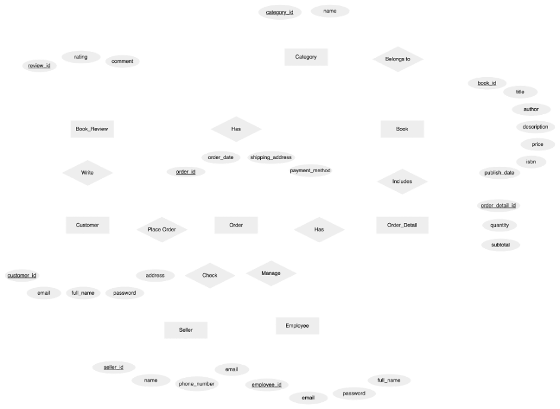
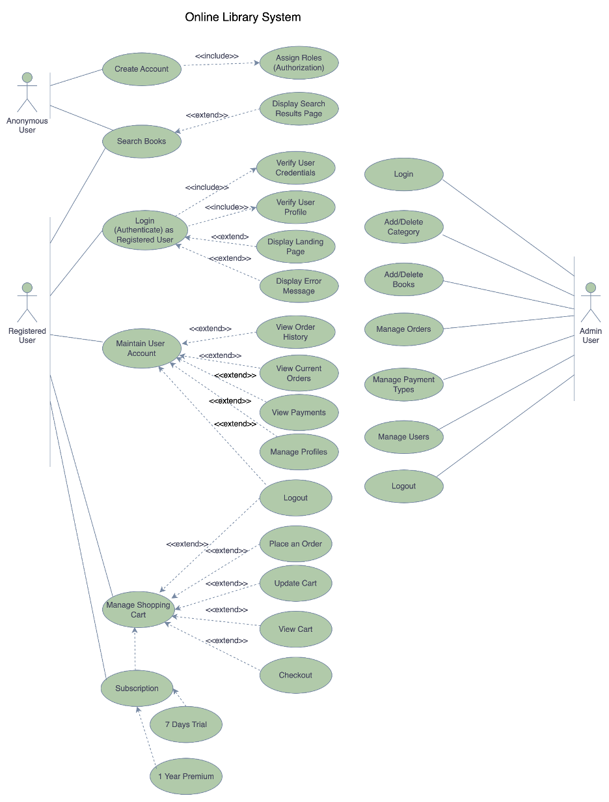

 # *BookHub*

**BookHub** is a Java web application that allows users to buy books online.Users of the system: visitors/browsers, registered customers, store clerks, store managers/super-users.

## Main features of the system

* [x] The online store has a home page showing the lists of new books, best-selling books and most popular books.
* [x] The system provides different categories for the books.
* [x] A visitor can browse the listings of the books and discussion forums.
* [ ] A visitor can apply to be a registered customer with a unique working email address.
* [x] A user can add the books to shopping cart.
* [x] A user can purchase books. 
* [x] A user can see his/her orders.
* [ ] A registered customer must provide a working credit card or deposit money to the account for possible purchase.
* [ ] A registered customer can browse the system, and make purchase options.
* [x] A user can search info, browse his/her own private purchasing history/expenses, comments and (start) votes on the items s/he purchased already.

## Video Walkthrough

## REST Endpoints

GIF created with [LiceCap](http://www.cockos.com/licecap/).

## ER Diagram

## Database Schema Diagram

## Use Case Diagram

## Application Architecture

## System Structure

## Notes

Describe any challenges encountered while building the app.