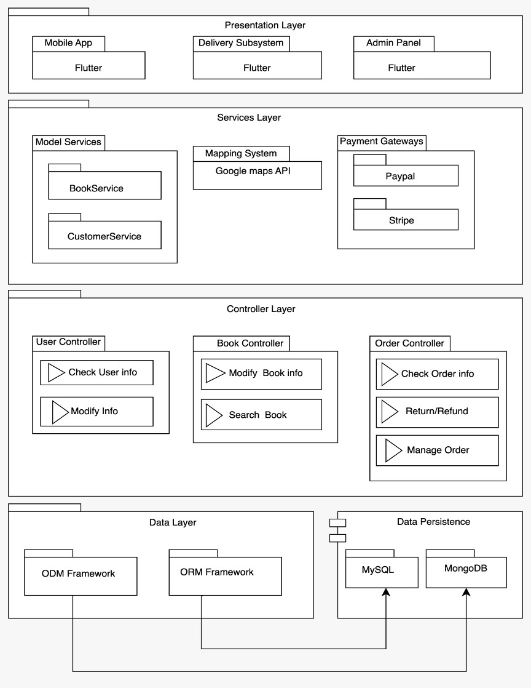

 # *BookHub*

**BookHub** is a Java web application that allows users to buy books online.Users of the system: visitors/browsers, registered customers, store clerks, store managers/super-users.


## Main features of the system

* [x] The online store has a home page showing the lists of new books, best-selling books and most popular books.
* [x] The system provides different categories for the books.
* [x] A visitor can browse the listings of the books and discussion forums.
* [ ] A visitor can apply to be a registered customer with a unique working email address.
* [x] A user can add the books to shopping cart.
* [x] A user can purchase books. 
* [x] A user can see his/her orders.
* [x] A registered customer must provide a working credit card or deposit money to the account for possible purchase.
* [x] A registered customer can browse the system, and make purchase options.
* [x] A user can search info, browse his/her own private purchasing history/expenses, comments and (start) votes on the items s/he purchased already.
* [x] Incorporated Okta Authorization Server to facilitate user login and logout functionalities.
* [x] Integrated Stripe payment gateway that allows users to make payments with debit/credit cards.

## Angular Frontend
[BookHub - Online Bookstore](https://github.com/MinhazRahman/book-hub)

## Video Walkthrough

## REST Endpoints


GIF created with [LiceCap](http://www.cockos.com/licecap/).

## ER Diagram


## Database Schema Diagram


## Use Case Diagram


## Application Architecture


## System Structure



## Notes
Describe any challenges encountered while building the app.
- User authentication and authorization.
- Connecting the Spring Boot backend with Angular frontend.
- Maintaining application security
- Deployment

## Requirements
The fully fledged server uses the following:

* [Spring Framework 6.0](https://docs.spring.io/spring-framework/reference/)
* [Spring Boot 3.0](https://spring.io/)
* [MySQL Database Management Server](https://www.mysql.com/)

## Dependencies
There are a number of third-party dependencies used in the project. Browse the Maven `pom.xml` file for details of libraries and versions used.

## Building the project
For building and running the application we need:

* [Java JDK 17 or higher](https://www.oracle.com/java/technologies/downloads/)
* [Maven 4.0.0 or higher](https://maven.apache.org/)
* [Git](https://git-scm.com/)

## Running the application locally

There are several ways to run a Spring Boot application on the local machine. One way is to execute the `main` method in the `org.springframework.boot.SpringApplication` class from the IDE.

Alternatively we can use the [Spring Boot Maven plugin](https://docs.spring.io/spring-boot/docs/current/reference/html/build-tool-plugins-maven-plugin.html) like so:

Clone the project and use Maven to build the server

```shell
mvn clean install
```

```shell
mvn spring-boot:run
```
## Deploying the application to OpenShift

The easiest way to deploy the sample application to OpenShift is to use the [OpenShift CLI](https://docs.openshift.org/latest/cli_reference/index.html):

```shell
oc new-app codecentric/springboot-maven3-centos~https://github.com/MinhazRahman/book-hub
```